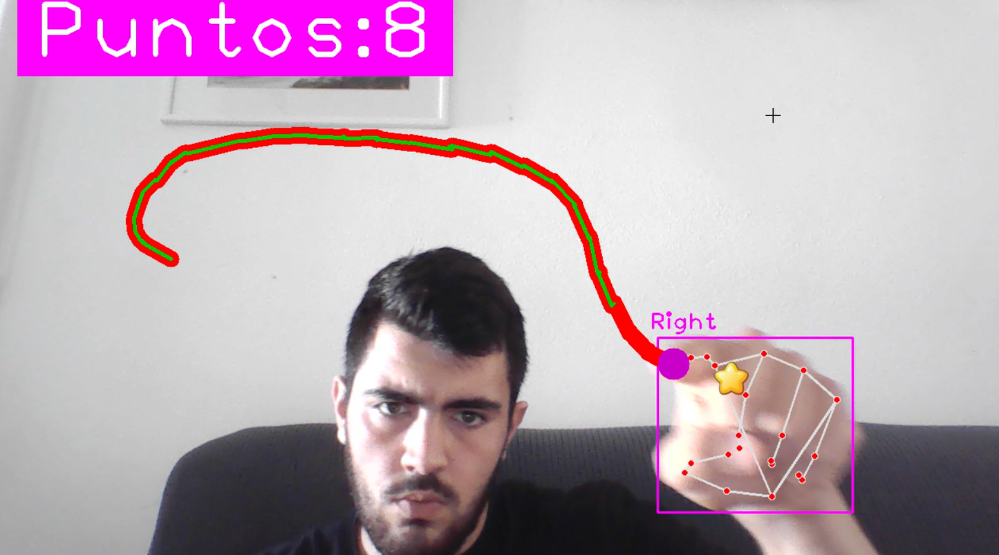
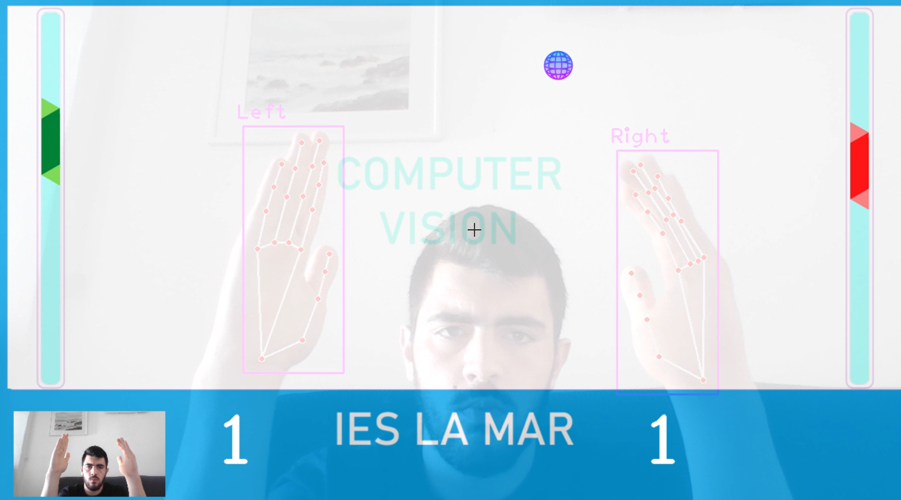

# CVProjects: Juegos con Visión por Ordenador con la librería OpenCV

¡Bienvenido a CVProjects! Este repositorio contiene una colección de juegos y otros proyectos interesantes desarrollados con técnicas de Visión por Computadora (Computer Vision) usando Python [2].

## Descripción del Proyecto

El objetivo de este proyecto es explorar las capacidades de la visión por computadora para crear interacciones novedosas y divertidas. Actualmente, el repositorio incluye implementaciones de juegos clásicos controlados a través de la cámara del ordenador [1, 2].

## Proyectos Incluidos

Actualmente, el repositorio cuenta con los siguientes proyectos:

1.  **Pong**: Una versión del clásico juego Pong donde controlas la pala usando tus manos.
2.  **Snake Game**: El tradicional juego de la serpiente, controlado mediante gestos con cualquier dedo.

## Requisitos

Para poder ejecutar estos proyectos, necesitarás tener instalado Python 3.x y las siguientes librerías.

• OpenCV (opencv-python): Es la librería estándar para tareas de visión por computadora, como capturar video de la cámara, procesar imágenes y detectar movimiento o gestos.
• Pygame : Para crear la interfaz gráfica del juego (la ventana, los objetos, los marcadores) y gestionar los eventos del usuario.
• NumPy: Fundamental para realizar operaciones matemáticas y de manipulación de matrices, algo esencial cuando se trabaja con imágenes en OpenCV.

pip install opencv-python numpy pygame
Instalación
1. Clona este repositorio en tu máquina local:
2. Navega al directorio del proyecto:
3. Instala las dependencias listadas en la sección de "Requisitos".
Cómo Jugar
A continuación se detallan las instrucciones para ejecutar cada juego.
(Nota: Esta sección es un placeholder. Deberías verificar los nombres de los archivos principales y añadir las instrucciones correctas.)
Pong
Para iniciar el juego de Pong, ejecuta el siguiente comando en tu terminal:
python Pong/main.py
Snake Game
Para iniciar el juego de la Serpiente, ejecuta este comando:
python SnakeGame/main.py
Contribuciones
Las contribuciones son bienvenidas. Si tienes ideas para mejorar los juegos existentes o quieres añadir un nuevo proyecto de visión por computadora, no dudes en crear un pull request o abrir un issue.
